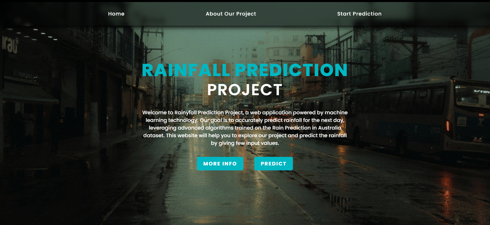
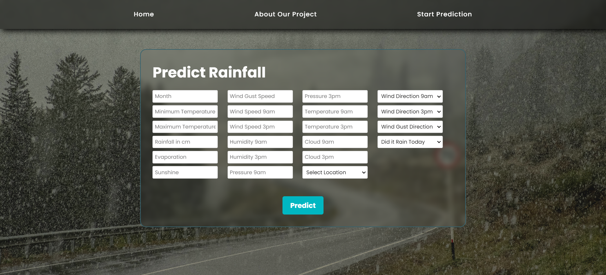
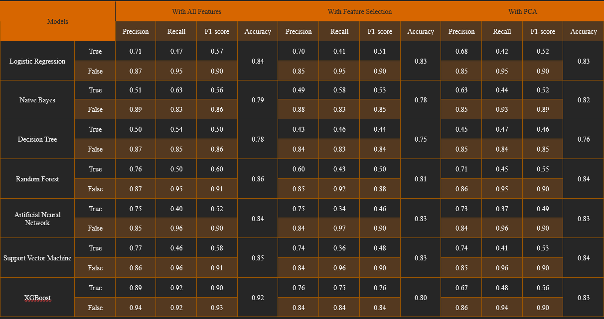

# Rainfall Prediction App

This project is a rainfall prediction app developed using an Australian dataset. The app aims to predict rainfall based on various meteorological features.

## Preprocessing Steps

1. **Removing Null Values**: Null values were removed from the dataset to ensure data integrity.

2. **Data Balancing**: Balancing techniques were applied to handle class imbalance in the dataset.

3. **Data Encoding**: Categorical features were encoded using techniques such as one-hot encoding or label encoding.

4. **Removing Outliers**: Outliers were detected and removed from the dataset to improve model performance.

5. **Feature Selection**: Relevant features were selected using filter method.

## Model Training

The preprocessed data was trained on various machine learning models, including:

- Artificial Neural Network (ANN)
- Decision Tree
- Naive Bayes
- Random Forest
- Support Vector Machine (SVM)
- XGBoost
- Logistic Regression

Additionally, unsupervised learning models were trained on the data:

- Principal Component Analysis (PCA)
- K-means Clustering

## Model Evaluation

Model performance was evaluated using metrics such as accuracy, precision, recall, and F1-score. XGBoost yielded the highest accuracy among all models.

## Integration with Backend

The XGBoost model with the best accuracy was integrated into the backend of the website. Users can input meteorological data, and the model predicts the likelihood of rainfall.

## Usage

To use the rainfall prediction app, follow these steps:

1. Install the necessary dependencies.
2. Run the backend server.
3. Access the website and input meteorological data.
4. View the predicted rainfall likelihood.

## Dependencies

- Python
- Pandas
- NumPy
- Scikit-learn
- Tensorflow
- XGBoost
- Flask (for backend integration)
- After installing all the dependencies run the following command

   ```bash
   python app.py
   ```

## Screenshots
### Home Page


### Prediction Page


### Sunny Page


### Rainy Page


### Model Comparison


## Acknowledgments

- Dataset [link](https://www.kaggle.com/datasets/arunavakrchakraborty/australia-weather-data)

---
